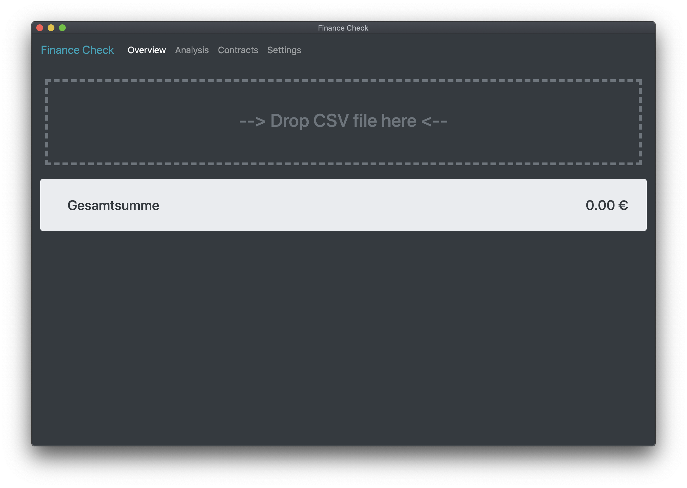
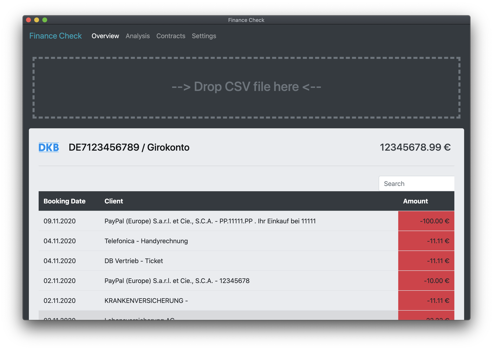
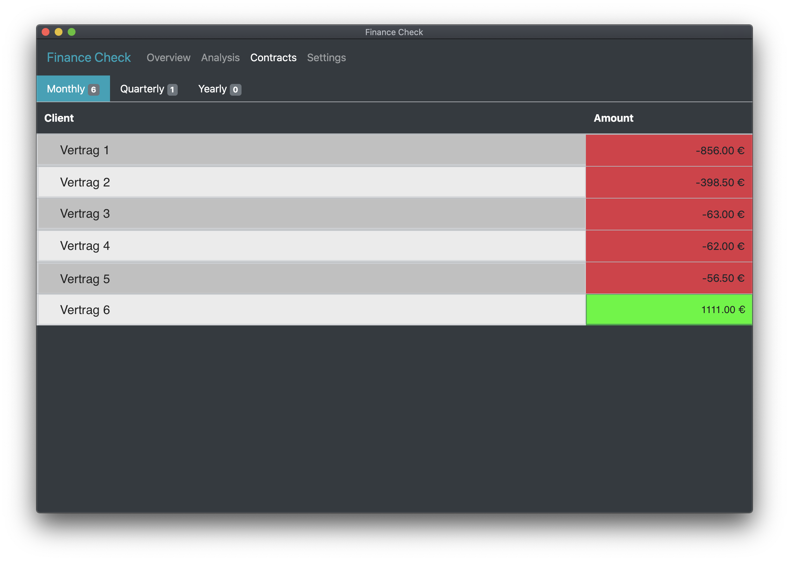
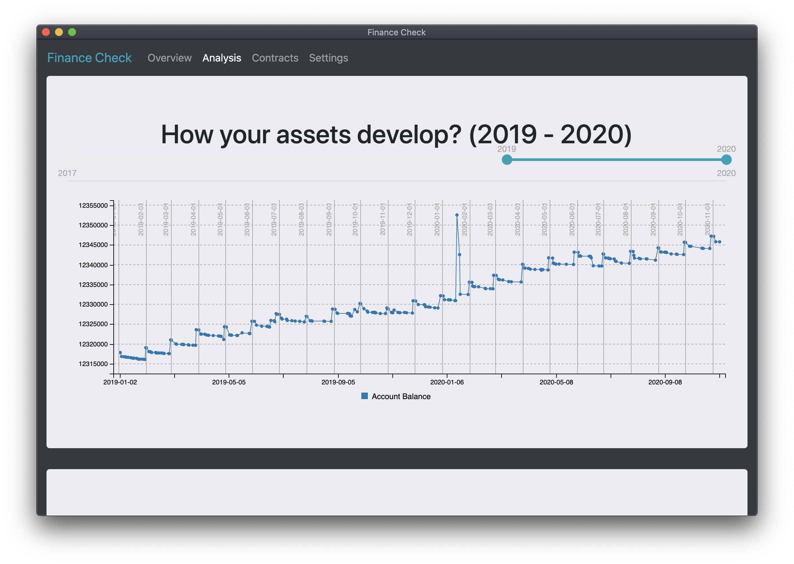
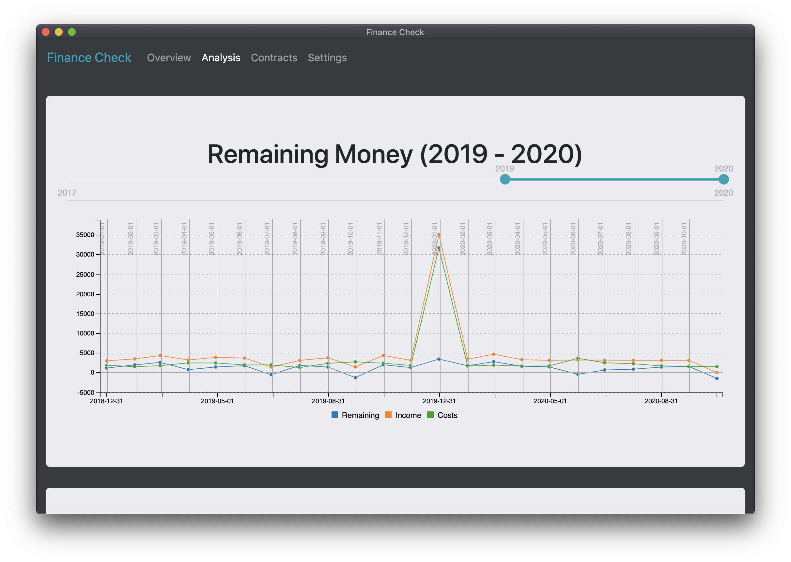
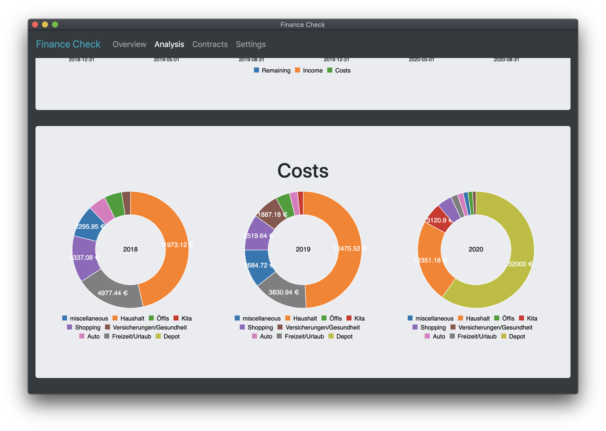
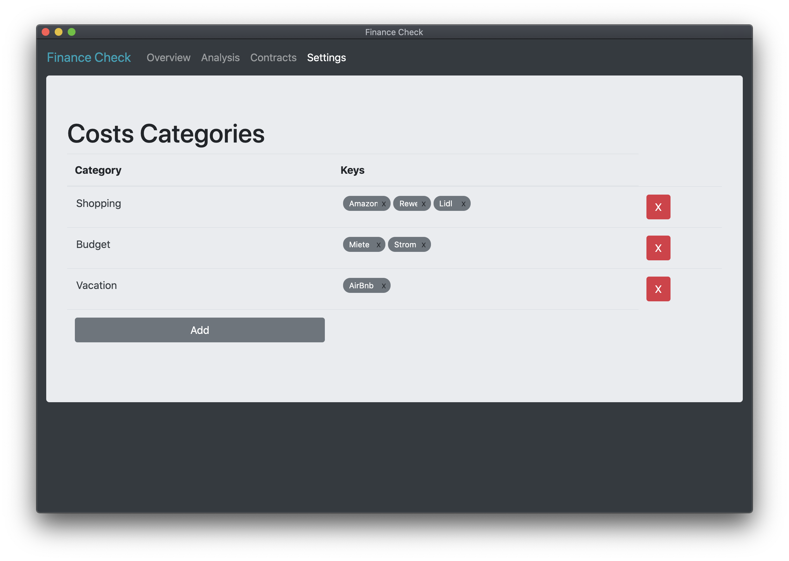
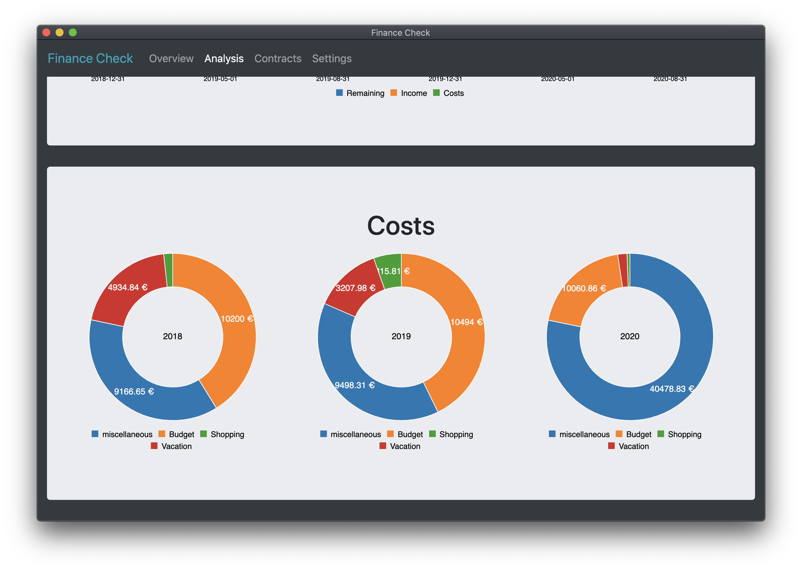

# Finance-Check (DKB banking)
A tool to check your finances (list costs and income, calculate remaining money, find contracts, check how your assets are developing, etc.).

Please note, at the moment it's just working for DKB banking and credit card accounts.

# TODO's
- [x] add round function to overview page
- [ ] check function to find yearly contracts
- [ ] check usage of loading spinners
- [x] add documentation
- [ ] add i18n
- [ ] check PSD2-API

## Overview Page
Manage your accounts or add a new one. To add a you bank account, you have to go to your DKB Banking and export the transactions as CSV-file. After that just simply drag that file into the App.

After adding bank account data, you can see your data.

## Contracts Page
Get an overview of your contracts.

## Analysis Page
Analyse your assets and costs.

### How your assets develop?

### Remaining Money

### Costs
To categorize your costs, see the settings page.

## Settings page
Add your catogies, you want to analyse. The first column defines your category name. The second column defines your key words, that should match with the cost entries.

After adding some categories, check the analysis page again.

